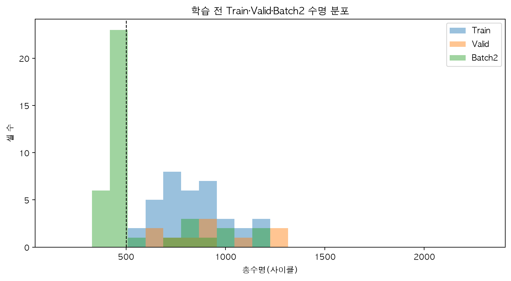
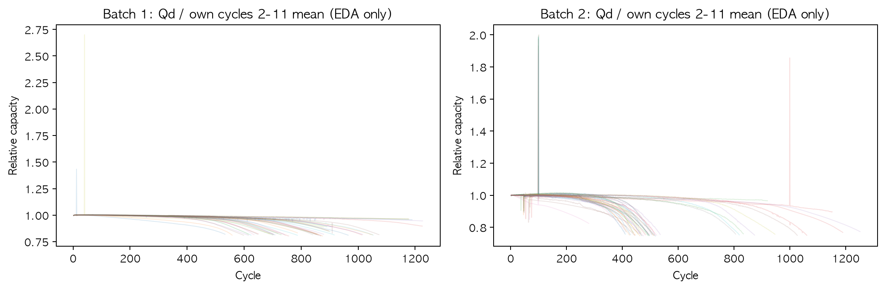
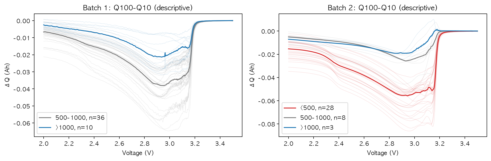
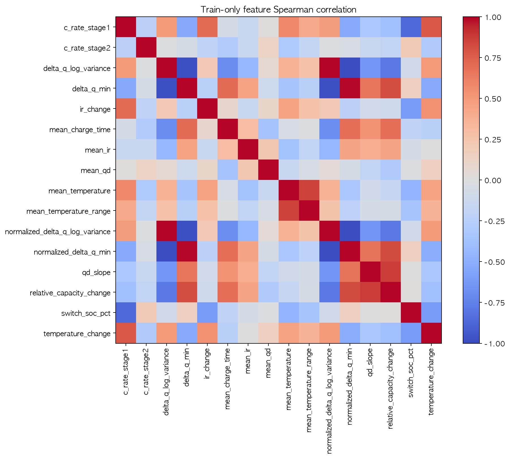
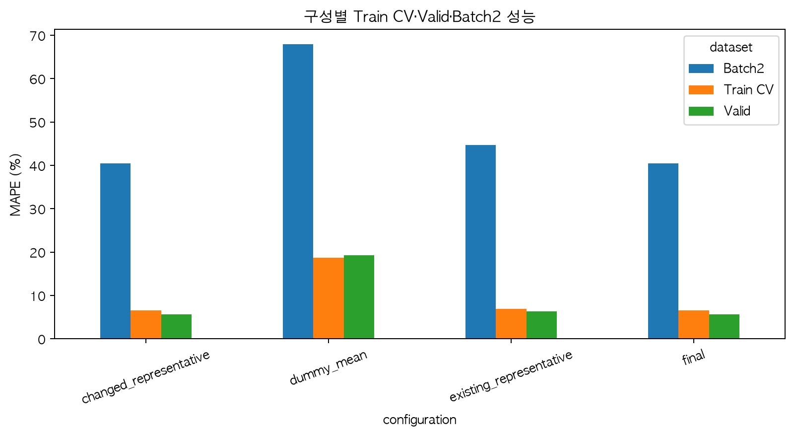
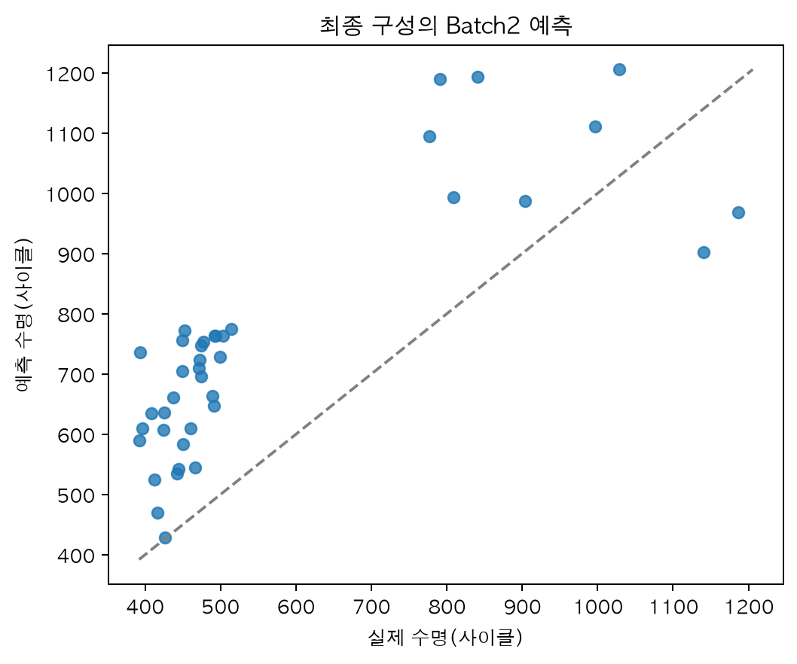

# 초기 100사이클 기반 배터리 총수명 예측

초기 100사이클의 전압별 방전 용량 변화, 용량, 내부저항, 온도, 충전시간과 충전 조건으로 배터리 셀의 총수명 `cycle_life`를 예측합니다.

이 저장소는 같은 공통 실험 코드를 두 방식으로 실행합니다.

- `python main.py`: 전체 실험을 실행하고 터미널에 표를 출력한 뒤 그래프를 표시합니다.
- `notebooks/01_battery_modeling.ipynb`: 데이터 준비부터 평가까지 각 단계를 셀별로 실행하고 바로 결과를 확인합니다.

두 방식 모두 `src.experiment.ExperimentRunner`의 공통 단계 코드를 사용합니다. `main.py`는 `run_experiment(CONFIG)`로 모든 단계를 연속 실행하고, 노트북은 같은 단계를 셀별로 호출합니다.

## 프로젝트 구조

```text
DS-MINI/
├── README.md
├── requirements.txt
├── .gitignore
├── config.py
├── main.py
├── assets/                 # 분석 그래프 PNG
├── docs/                   # 문제 해결·설계 결정 기록
├── data/
│   ├── README.md
│   └── raw/
├── notebooks/
│   └── 01_battery_modeling.ipynb
└── src/
    ├── __init__.py
    ├── data.py
    ├── eda.py
    ├── features.py
    ├── modeling.py
    ├── experiment.py
    └── reporting.py
```

## 설치

Python 3.14에서 분석을 실행했습니다. 분석 라이브러리와 노트북 실행 도구의 설치 버전은 `requirements.txt`에 지정되어 있습니다.

### macOS·Linux

```bash
git clone https://github.com/mongamonga1/DS-MINI.git
cd DS-MINI

python -m venv .venv
source .venv/bin/activate
python -m pip install --upgrade pip
python -m pip install -r requirements.txt
python -m ipykernel install --user --name ds-mini --display-name "Python (DS-MINI)"
```

### Windows PowerShell

```powershell
git clone https://github.com/mongamonga1/DS-MINI.git
cd DS-MINI

python -m venv .venv
.venv\Scripts\activate
python -m pip install --upgrade pip
python -m pip install -r requirements.txt
python -m ipykernel install --user --name ds-mini --display-name "Python (DS-MINI)"
```

`ipykernel` 등록은 한 번만 수행하면 됩니다. 이후 터미널에서 `.venv`를 활성화한 상태로 실행합니다.

## 데이터 준비

대용량 원본은 Git에 포함하지 않습니다. [data/README.md](data/README.md)의 파일 두 개를 `data/raw/`에 배치합니다.

프로그램은 다음 순서로 원본을 확인합니다.

1. `config.py`의 `data_dir` 또는 `ESS_DATA_DIR`
2. 현재 작업공간의 기존 로컬 데이터 후보 위치
3. `config.py`에 직접 다운로드 주소가 등록된 경우에만 다운로드
4. 확보하지 못하면 필요한 파일명을 안내하고 중단

Batch3와 추가 가변충전 데이터는 분석 대상에서 제외합니다.

## 터미널 실행

```bash
python main.py
```

실행 과정은 다음과 같습니다.

```text
원본 읽기·품질 처리
→ 고정 Train·Valid·Batch2 분할
→ 초기 피처 계산
→ Train 기반 EDA·설명용 배치 진단
→ 전체 후보 1차 CV
→ 분기별 후보 선별
→ 확장·변화 피처 CV
→ 생존 후보 매개변수 탐색
→ Train 36셀 최종 학습
→ Valid 10셀·Batch2 39셀 평가
→ 단수명·프로토콜·무전류 그룹 오류 분석
```

## 노트북 실행

```bash
source .venv/bin/activate  # Windows PowerShell: .venv\Scripts\activate
python -m jupyter lab
```

JupyterLab에서 `notebooks/01_battery_modeling.ipynb`를 연 뒤 다음 순서로 실행합니다.

1. 화면 오른쪽 위의 커널 이름을 선택합니다.
2. 등록한 **Python (DS-MINI)** 커널을 선택합니다.
3. **Kernel → Restart Kernel and Run All Cells**를 실행합니다.

커널 목록에 나타나지 않으면 JupyterLab을 종료하고 가상환경이 활성화되었는지 확인한 뒤 커널 등록 명령을 다시 실행합니다.

노트북은 다음 순서로 셀을 실행합니다.

```text
원본 읽기·분할 → 피처 계산 → EDA → 1차 CV → 확장 CV → 매개변수 탐색
→ 최종 학습·평가 → 오류 분석 → 그래프
```

각 단계 셀은 `ExperimentRunner`의 해당 메서드를 호출한 뒤 결과를 바로 표시합니다. 완료된 단계의 셀을 다시 실행하면 기존 상태를 반환하므로 같은 모델을 중복 학습하지 않습니다. 설정을 바꿨다면 커널을 재시작하고 첫 셀부터 다시 실행합니다.

## 공통 실험 설정

모든 설정은 `config.py`의 `ExperimentConfig`에서 관리합니다.

- 난수: 42
- Batch1 검증 셀: 10
- 학습 내부 검증: 5-fold
- 타깃: 원래 수명, `log10(cycle_life)`
- 모델: ElasticNet, Ridge, RandomForest
- 기준선: 학습 fold 평균을 사용하는 DummyRegressor
- 전처리: 학습 fold 중앙값 대체와 표준화
- 선택 기준: 학습 내부 CV 평균 MAPE
- 단계별 생존 후보 수와 모델별 탐색 범위
- 무전류 기준: cycle5에서 `|I| < 0.01 A`
- 긴 무전류 구간 기준: 연속 구간이 2분 초과
- 최종 평가 실행 여부

Batch1 셀 목록은 정렬한 뒤 `train_test_split(test_size=10, random_state=42)`로 한 번 분할합니다. 학습용 36셀의 5개 fold도 한 번 만들고 모든 후보가 재사용합니다.

## 피처 후보

초기 후보는 다음 세 그룹으로 구성합니다.

- 설계 피처: A, B, C-time, C-capacity, C-resistance, C-temperature, C-policy
- 기존 조합: 용량과 충전 조건·온도·내부저항 조합
- 변경 조합: 평균 Qd 제외, 상대 용량 변화, 정규화 ΔQ, 온도·내부저항 변화

1차 CV의 모델·타깃·피처 그룹별 상위 후보에서 변화 피처 추가, 기울기 교체, 평균 Qd 제외와 정규화 ΔQ 후보를 확장합니다. 생존 후보에만 모델별 매개변수 탐색을 적용합니다.

물리량 기반 피처는 표준화 전에 계산합니다. 결측 대체와 표준화는 각 CV 학습 fold에서만 학습하며 Valid와 Batch2에는 변환만 적용합니다.

## 데이터 처리 기준

- 실제 사이클 번호 100 이하만 사용합니다.
- ΔQ는 같은 전압격자의 `Q100 - Q10`입니다.
- ΔQ 로그 분산은 `ddof=0`, 하한 `1e-12`를 사용합니다.
- 방전 용량 평균·기울기는 2∼100사이클에서 계산합니다.
- 상대 용량 변화는 `(91∼100 평균 - 2∼11 평균) / 2∼11 평균`입니다.
- 내부저항·온도 변화는 뒤 구간 평균에서 앞 구간 평균을 뺍니다.
- 정규화 ΔQ는 셀의 2∼11사이클 평균 Qd로 나눕니다.
- Batch1 첫 사이클의 확인된 빈 온도·충전시간은 결측 처리합니다.
- 내부저항 0은 결측 처리합니다.
- 확인된 Batch2 `cell038`에서 `Tmin=-270` 또는 `Tmax=400`인 행의 온도 요약값만 결측 처리하고 셀은 유지합니다.
- 충전 조건 해석에 실패하면 원문은 보존하고 숫자 피처는 결측으로 둡니다.
- 짧은 수명을 이유로 셀을 삭제하거나 라벨을 바꾸지 않습니다.

전체 Qd 이력과 cycle5 전류·시간은 EDA와 사후 오류 설명을 위해 별도로 읽습니다. 후기 Qd, 관측 종료 시점, Knee, 무전류 그룹과 프로토콜 접미사는 모델 입력 피처에 포함하지 않습니다.

## EDA

EDA에는 데이터 품질 처리 규칙을 적용한 측정값을 사용했습니다. 피처-수명 상관과 피처 중복은 Train 36셀만 사용하고, Batch2는 분포 설명과 최종 모델 고정 후 오류 해석에만 사용했습니다.

| 관측한 내용                                                                                       | 예측 문제                                                            | 대응 후보                                            | CV·평가 확인                                                            |
| ------------------------------------------------------------------------------------------------- | -------------------------------------------------------------------- | ---------------------------------------------------- | ----------------------------------------------------------------------- |
| Train에는 500사이클 미만 셀이 없지만 Batch2에는 28/39셀(71.8%)이 존재                             | 학습 범위보다 짧은 셀을 과대 예측할 위험                             | 원·로그 타깃, 제한된 Random Forest 비교              | 최종 모델은 Batch2 단수명 28셀을 모두 과대 예측했고 단수명 MAPE는 44.3% |
| Train 36셀 중 Qd 기울기가 0 이상인 셀이 13셀, 상대 용량 변화가 0 이상인 셀이 19셀                 | 초기 평균 용량이나 단일 기울기만으로 열화를 구분하기 어려움          | ΔQ A·B, 평균 Qd 제외, 상대 용량 변화, 정규화 ΔQ      | 변경 피처 대표 CV MAPE 6.57%, 기존 대표 6.86%                           |
| Batch2의 `4.8C(80%)-4.8C` 평균 수명은 483.6, `newstructure`는 871.7사이클                         | C1·C2·SOC 숫자만으로 실험 조건 차이를 모두 표현하지 못함             | C-policy 후보 비교, 원문 접미사는 오류 분석에만 유지 | C-policy와 B의 1차 CV 최적 MAPE가 모두 약 8.49%로 추가 이득이 제한적    |
| Batch2 긴 무전류 그룹은 라벨 30셀·평균 453.0사이클, 짧은 그룹은 9셀·평균 941.6사이클              | 배치 조건 이동이 단수명 과대 예측과 함께 나타날 수 있음              | 무전류 그룹은 모델에 넣지 않고 사후 오류만 비교      | 긴 그룹 MAPE 44.7%, 짧은 그룹 25.9%                                     |
| Train 전용 최고 절대 순위상관은 정규화 ΔQ 로그 분산의 -0.847, 절대 순위상관 0.9 이상 피처쌍은 6개 | 소표본의 반복 상관 탐색과 중복 피처가 선택을 불안정하게 만들 수 있음 | 피처군별 비교와 Ridge·ElasticNet 규제                | 최종 모델은 Ridge와 로그 타깃을 선택                                    |

전체 Qd 곡선은 초기 총용량만으로 보이지 않는 수명 전반의 열화 형태를 설명하기 위한 그림으로만 사용합니다. 후기 곡선은 예측 시점에 알 수 없으므로 상관 계산, 후보 선택, 모델 학습에는 사용하지 않습니다.

## 최종 모델과 성능

Train 내부 CV에서 선택된 구성은 `C_capacity + 상대 용량 변화`, Ridge `alpha=1.0`, `log10(cycle_life)` 타깃입니다. 입력 피처는 ΔQ 로그 분산·최솟값, 평균 Qd, 초기 Qd 기울기, 상대 용량 변화입니다.

| 평가                 | 셀 수 | MAPE (%) | MAE (사이클) | RMSE (사이클) |
| -------------------- | ----: | -------: | -----------: | ------------: |
| Train 5-fold CV 평균 |    36 |     6.57 |        55.90 |         72.94 |
| Valid                |    10 |     5.65 |        54.44 |         69.44 |
| Batch2               |    39 |    40.40 |       209.47 |        226.91 |

| GAP            | 값 (%p) |
| -------------- | ------: |
| Valid − CV     |   -0.92 |
| Batch2 − Valid |  +34.74 |
| Batch2 − 9.1   |  +31.30 |

기존 피처 대표의 Batch2 MAPE는 44.70%, 변경 피처 대표는 40.40%였습니다. 변경 피처가 일부 개선했지만, Train에 없던 단수명 분포로 인한 외부 배치 성능 저하를 해결하지는 못했습니다.

## 오류 분석과 ESS 해석

- Batch2의 500사이클 미만 28셀은 모두 실제보다 길게 예측됐습니다. 단수명 셀을 장수명으로 판단하면 셀 선별과 추가 검사 우선순위가 늦어질 수 있습니다.
- 500∼1,000사이클 구간 MAPE는 34.9%, 1,000사이클 초과 구간은 18.8%였습니다.
- Batch2에서 기존 표기 프로토콜과 긴 무전류 그룹이 같은 30셀, `newstructure`와 짧은 그룹이 같은 9셀로 나타났습니다. 따라서 접미사와 휴지 조건의 효과를 분리하거나 인과관계로 해석할 수 없습니다.
- 현재 모델은 초기 시험 데이터에 기반한 선별·추가 검사·점검 계획의 참고 수단입니다. 실제 ESS 운전 조건의 수명이나 안전성을 직접 보장하지 않습니다.
- 개선하려면 목표 운전 조건에서 단수명 셀을 추가 수집하고, 프로토콜·휴지 조건을 분리한 독립 데이터로 다시 검증해야 합니다.

## 결과 해석 범위

그래프는 `assets/`에 PNG로 저장합니다. 표·예측은 별도 CSV나 모델 파일로 저장하지 않습니다. 노트북을 저장하면 실행 출력과 그래프는 노트북 파일 안에 남습니다.

후보 탐색 자체는 설정된 전체 조합으로 수행하지만, 터미널과 노트북에는 단계별로 최대 10개만 표시합니다. 표시 후보는 CV 성능을 우선하면서 모델·타깃 변환·피처군·기존/변경 구성의 다양성을 함께 반영하고, 전체 평가 수와 생존·탈락 사유 집계는 별도로 유지합니다.

Batch2는 탐색 과정에서 관측된 평가 데이터입니다. 후보 선택은 Train 내부 CV를 기준으로 합니다. 9.1%는 논문 참고값이며, 배치·분할 조건이 달라 직접적인 재현 성능 비교에는 한계가 있습니다.

## 참고문헌

- Severson et al. (2019). _Data-driven prediction of battery cycle life before capacity degradation_. Nature Energy, 4, 383–391. [논문](https://doi.org/10.1038/s41560-019-0356-8)
- [저자 공개 코드](https://github.com/rdbraatz/data-driven-prediction-of-battery-cycle-life-before-capacity-degradation)

## 그래프 이미지

`main.py` 실행 또는 노트북의 그래프 셀 실행 시 공통 출력 함수가 `assets/`에 PNG를 저장합니다. 같은 이름은 최신 실행 그래프로 덮어쓰며 파일 번호가 계속 늘어나지 않습니다. 노트북에서도 각 그래프는 그대로 표시합니다. `show_eda_plots=False`이면 EDA 그래프 생성·저장은 건너뜁니다. 아래에서 주요 분석 그래프를 확인할 수 있습니다.













나머지 초기 신호·무전류 진단·원본 용량·ΔQ 분포·로그 변환·배치 분포·충전 프로토콜 그래프도 같은 폴더에 저장됩니다.


## 분석·설계 기록

- [트러블슈팅](docs/트러블슈팅.md): 데이터 품질, 비교 조건, 표기 문제, 배치 성능 차이의 진단과 처리.
- [설계 고민과 결정](docs/설계_고민과_결정.md): 단수명 데이터, 피처 비교, 후보 선별, 실행 구조와 결과 보관에 관한 선택 이유.
